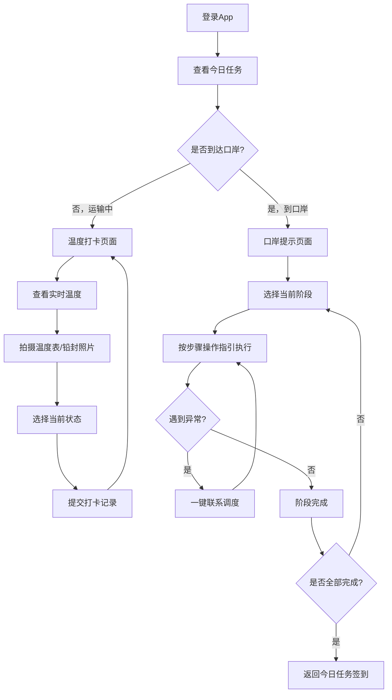

## 1. 产品概述

跨境冷链司机温控执行移动应用，解决车辆在口岸排队、查验和临时停靠时的温控断档问题。通过任务跟踪、温度打卡和口岸流程指引，确保冷链货品在通关全过程中温度合规。

- 核心用户：跨境冷链运输司机
- 核心价值：降低跨境通关温控风险，标准化司机在口岸的操作流程

---

## 2. 核心功能

### 2.1 用户角色

| 角色 | 登录方式 | 核心权限 |
|------|----------|----------|
| 冷链司机 | 工号/手机号登录 | 查看任务、温度打卡、定位签到、查看口岸指引 |

### 2.2 功能模块

1. **今日任务页面**：任务卡片列表、货品详情、定位签到
2. **温度打卡页面**：实时温度大屏、电池/开门状态、拍照上传、状态提交
3. **口岸提示页面**：分阶段步骤指引、操作提醒、异常处理流程

### 2.3 页面详情

| 页面名称 | 模块名称 | 功能描述 |
|----------|----------|----------|
| 今日任务 | 头部状态栏 | 显示司机姓名、车牌号、当前日期、在途任务数 |
| 今日任务 | 任务卡片 | 展示货品名称、目标温区、封签号、通关口岸、客户联系人 |
| 今日任务 | 进度追踪条 | 显示任务当前阶段（提货→运输→口岸→换装→送达） |
| 今日任务 | 签到按钮组 | 到达换装点签到、到达监管仓签到（GPS定位验证） |
| 温度打卡 | 温度大屏区 | 超大号数字显示当前车厢温度、目标温区范围、温区状态指示灯 |
| 温度打卡 | 设备状态卡 | 冷机电池电量百分比、外接电源状态、最近一次开门时间 |
| 温度打卡 | 拍照上传区 | 温度表照片、铅封照片、外接电源照片，支持拍照和相册选择 |
| 温度打卡 | 状态选择器 | "等待查验""补冰完成""已接电""开门查验中""温度异常"等快捷状态 |
| 温度打卡 | 提交打卡按钮 | 一键提交当前温度记录和状态，含备注输入 |
| 温度打卡 | 打卡历史列表 | 今日历史打卡记录，时间线形式展示 |
| 口岸提示 | 阶段选择Tab | 排队等待→查验准备→开门查验→换装作业→异常处理 |
| 口岸提示 | 步骤卡片 | 每个阶段3-5条关键操作步骤，大号字体突出核心动作 |
| 口岸提示 | 紧急联系区 | 调度电话、海关联络员快速拨打按钮 |

---

## 3. 核心流程

司机登录后进入今日任务页面，查看当前任务详情。在运输途中定期进入温度打卡页面查看温度并提交记录。到达口岸前切换到口岸提示页面查看对应阶段的操作指引。

---

## 4. 用户界面设计

### 4.1 设计风格

**整体定位：工业实用型 · 冷链专业感**

- **主色调**：深海蓝 #0A3D62（专业、可信）+ 冰青色 #00CEC9（冷链、温度）
- **辅助色**：
  - 安全绿 #26DE81（温度正常、已完成）
  - 警戒橙 #FDCB6E（预警、接近临界）
  - 危险红 #E74C3C（温度异常、紧急）
  - 深灰 #2D3436（文字主体）
- **按钮风格**：大圆角（16px）、实心填充、大号点击区域（最小48x48px），带微阴影和按压反馈
- **字体**：中文使用"思源黑体"，数字使用"JetBrains Mono"等宽字体确保温度读数清晰
- **布局风格**：卡片式布局，模块间距宽松，内容区最大宽度适配手机屏幕（375-428px）
- **图标风格**：线性图标，描边2px，统一圆角处理

### 4.2 页面设计概览

| 页面名称 | 模块名称 | UI元素设计要点 |
|----------|----------|----------------|
| 今日任务 | 头部状态栏 | 深色渐变背景，白色文字，车牌号突出显示 |
| 今日任务 | 任务卡片 | 冰青色左侧色条标识温区类型，信息分组清晰 |
| 今日任务 | 进度追踪条 | 5节点横向时间轴，当前节点脉冲动画高亮 |
| 今日任务 | 签到按钮 | 满宽度渐变按钮（蓝→青），GPS图标+文字，点击有定位动画 |
| 温度打卡 | 温度大屏区 | 占据页面上半部，深色渐变背景，温度数字(96px)超巨大，带呼吸光效 |
| 温度打卡 | 设备状态卡 | 三列等分布局，图标+数值+标签，电池格可视化 |
| 温度打卡 | 拍照上传区 | 三格横向布局，空状态虚线框+相机图标，已上传显示缩略图 |
| 温度打卡 | 状态选择器 | 横向滚动胶囊按钮，选中态渐变填充，未选中态浅灰描边 |
| 温度打卡 | 提交按钮 | 底部吸底固定按钮，上方悬浮时带毛玻璃效果 |
| 口岸提示 | 阶段选择Tab | 顶部横向Tab，下划线指示器，选中文字加粗变色 |
| 口岸提示 | 步骤卡片 | 带序号圆角方块，步骤文字加粗重点词高亮 |
| 口岸提示 | 紧急联系区 | 红色边框强调，电话号码特大号，一键拨打图标 |

### 4.3 响应式

- **移动端优先**：以手机竖屏（375px-428px宽度）为主要设计目标
- **触摸优化**：所有可点击元素最小尺寸48x48px，间距至少8px
- **屏幕适配**：使用rem/vw单位，文字大小不随系统缩放过度变化
- **横屏适配**：底部导航栏自动调整布局，主要内容区可滚动

### 4.4 动效设计

- 页面切换：左右滑入（300ms ease）
- 温度数字变化：数字滚动动画（500ms）
- 状态正常：绿色呼吸光晕（2s循环）
- 状态异常：红色脉冲闪烁+震动反馈
- 打卡提交：按钮加载旋转→成功对勾弹出（800ms）
