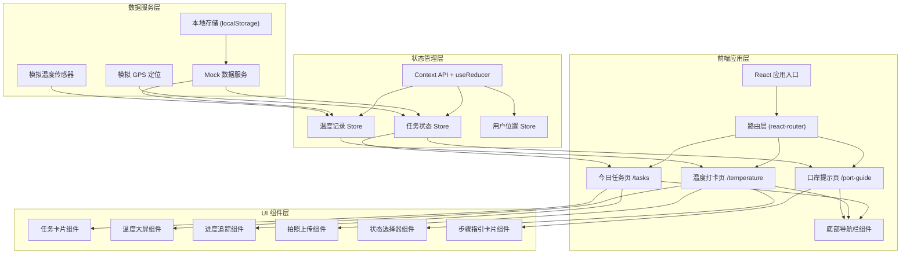
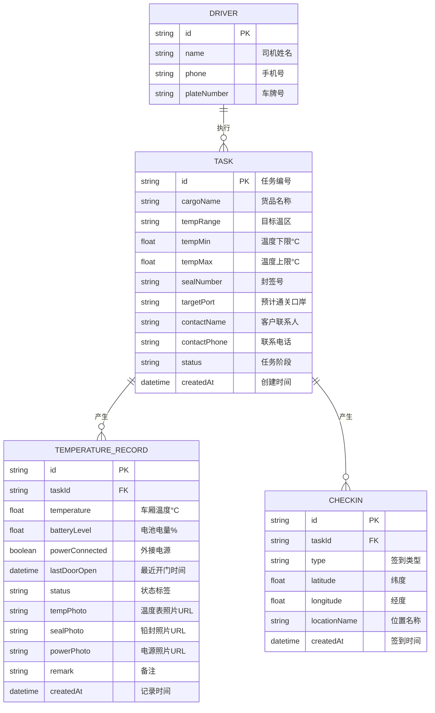

## 1. 架构设计



## 2. 技术描述

- **前端框架**：React@18 + TypeScript
- **构建工具**：Vite@5
- **样式方案**：Tailwind CSS@3 + CSS 变量主题系统
- **路由管理**：react-router-dom@6
- **状态管理**：React Context + useReducer（轻量级，无需引入 Redux）
- **图标库**：lucide-react（轻量级线性图标，冷链场景适配）
- **动画方案**：framer-motion（页面切换、数字滚动、呼吸光效）
- **数据层**：本地 Mock 数据 + localStorage 持久化
- **移动端适配**：viewport meta + Tailwind 响应式断点

### 目录结构

```
src/
├── components/           # 通用 UI 组件
│   ├── layout/          # 布局组件（导航栏、页面容器）
│   ├── tasks/           # 任务页面专用组件
│   ├── temperature/     # 温度页面专用组件
│   └── port-guide/      # 口岸页面专用组件
├── pages/               # 页面级组件
│   ├── TasksPage.tsx
│   ├── TemperaturePage.tsx
│   └── PortGuidePage.tsx
├── context/             # 全局状态管理
│   ├── TaskContext.tsx
│   └── TemperatureContext.tsx
├── data/                # Mock 数据与常量
│   ├── mockTasks.ts
│   ├── mockRecords.ts
│   └── portSteps.ts
├── types/               # TypeScript 类型定义
│   └── index.ts
├── hooks/               # 自定义 Hooks
│   ├── useTemperature.ts
│   └── useGeolocation.ts
├── utils/               # 工具函数
│   ├── formatters.ts
│   └── storage.ts
├── App.tsx
├── main.tsx
└── index.css
```

## 3. 路由定义

| 路由路径 | 页面名称 | 说明 |
|----------|----------|------|
| `/` or `/tasks` | 今日任务页 | 默认首页，展示司机当日任务列表与详情 |
| `/temperature` | 温度打卡页 | 实时温度大屏、拍照上传、状态提交 |
| `/port-guide` | 口岸提示页 | 分阶段操作指引与紧急联系 |

底部导航栏常驻三个入口，点击切换不刷新页面。

## 4. 数据模型

### 4.1 数据模型定义



### 4.2 核心类型定义

```typescript
type TaskStage = 'pickup' | 'transit' | 'port' | 'transload' | 'delivered';
type TempStatus = 'waiting_inspection' | 'ice_refilled' | 'power_connected' | 'door_open_inspection' | 'temp_abnormal' | 'normal_transit';

interface Task {
  id: string;
  cargoName: string;
  tempRange: string;
  tempMin: number;
  tempMax: number;
  sealNumber: string;
  targetPort: string;
  contactName: string;
  contactPhone: string;
  stage: TaskStage;
  checkIns: CheckIn[];
  createdAt: string;
}

interface TemperatureRecord {
  id: string;
  taskId: string;
  temperature: number;
  batteryLevel: number;
  powerConnected: boolean;
  lastDoorOpen: string;
  status: TempStatus;
  tempPhoto?: string;
  sealPhoto?: string;
  powerPhoto?: string;
  remark?: string;
  createdAt: string;
}

interface CheckIn {
  id: string;
  taskId: string;
  type: 'transload' | 'supervision_warehouse';
  latitude: number;
  longitude: number;
  locationName: string;
  createdAt: string;
}

interface Driver {
  id: string;
  name: string;
  phone: string;
  plateNumber: string;
}

interface PortStep {
  stage: 'queue' | 'prepare' | 'inspection' | 'transload' | 'emergency';
  title: string;
  steps: string[];
  highlightWords: string[];
}
```

## 5. 关键技术决策

### 5.1 温度大屏数字滚动
使用 framer-motion 的 `AnimatePresence` + 自定义数字翻转组件，确保温度变化时平滑过渡。

### 5.2 拍照上传模拟
使用 `<input type="file" accept="image/*" capture>` 调用设备摄像头，FileReader 转 base64 本地预览。

### 5.3 GPS 定位模拟
使用 Geolocation API 获取真实位置（浏览器支持时），否则回退到 Mock 坐标。

### 5.4 数据持久化
所有打卡记录、签到状态存储到 localStorage，模拟 App 本地存储行为。
